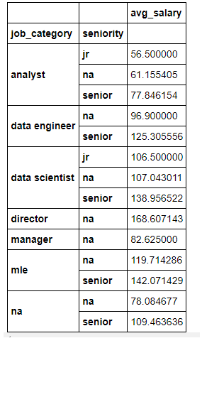
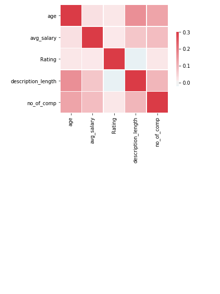
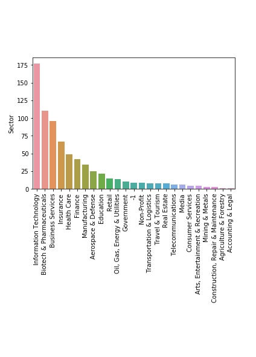
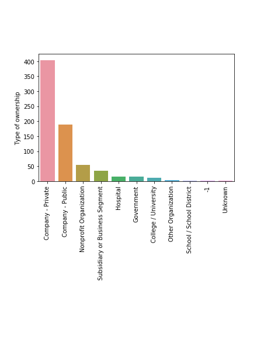

# Glassdoor-Salary-Prediction

## Overview
* Designed a tool that estimates job salaries to help data scientists negotiate their income when they are applying for different data science jobs
* Scraped 950 job descriptions from Glassdoor.com using Selenium and python.
* Applied various regression models-  Multiple Linear, Ridge, Lasso, Support Vector, Decision tree, and Random Forest Regressors using RandomizedSearchCV to reach the best model.
* Built a client-facing API using flask.

## Resources Used
**Python Version:** 3.8.2

**Packages:**  pandas, numpy, sklearn, matplotlib, seaborn, selenium, flask, json, pickle

**Scraper Article:** [https://towardsdatascience.com/selenium-tutorial-scraping-glassdoor-com-in-10-minutes-3d0915c6d905](https://towardsdatascience.com/selenium-tutorial-scraping-glassdoor-com-in-10-minutes-3d0915c6d905)

**Flask Productionization:** [https://towardsdatascience.com/productionize-a-machine-learning-model-with-flask-and-heroku-8201260503d2](https://towardsdatascience.com/productionize-a-machine-learning-model-with-flask-and-heroku-8201260503d2)

## Web Scraping
Tweaked the web scraper github repo (above) to scrape 950 job postings from glassdoor.com. With each job, we got the following:
* Job title
* Salary Estimate
* Job Description
* Rating
* Company
* Location
* Company Headquarters
* Company Size
* Company Founded Date
* Type of Ownership
* Industry
* Sector
* Revenue
* Competitors

## Data Cleaning
During data collection entries without salary data were scraped. After collection, the data is cleaned to allow for the best predictions and accuracy of our model. Additionally new feachurs are parsed from existing fields (columns) and some existing variables are changed as follows:

* Parsed job seniority from job title
* Parsed numeric data from:
  * salary
  * rating
  * revenue
  * founded
  * company size
* Created field containng lists for:
  * companies sector
  * companies industry
  * companies competitors
  * companies ownership type
* Made a new column for company state
* Created new veriable:
  * 1 if "company city" == "HQ city"
  * otherwise 0
* Made columns for if different skills were listed in the job description
  * Python
  * Excel
  * SQL
  * AWS
  * Spark
  * Tableau
  * PowerBi
  * R
 ## Exploratory data analysis and Feature Engineering
I looked at the distributions of the data and the value counts for the various categorical variables. Below are a few highlights from the pivot tables. 

## Model Building
First, I transformed the categorical variables into dummy variables. I also split the data into train and tests sets with a test size of 20%.

I tried three different models and evaluated them using Mean Absolute Error. I chose MAE because it is relatively easy to interpret and outliers aren’t particularly bad in for this type of model.

I tried different models:
 * Multiple Linear Regression
 * Lasso Regression
 * Ridge Regression
 * Decision Tree Regression
 * Support Vector Regression
 * Random Forest Regression

## Model Performance:
The Random Forest model far outperformed the other approaches on the test and validation sets.

| Model                      | MEA   | 
| :------------------------: |------:|
| Multiple Linear Regression | ?     |
| Lasso Regressor            | ?     | 
| Ridge Regressor            | ?     | 
| Randome Forest Regressor   | ?     |
| Decision Tree Regressor    | ?     | 
| Support Vector Regressor   | ?     | 

## Productionization:
In this step, I built a flask API endpoint that was hosted on a local webserver by following along with the towards data science tutorial in the reference section above. The API endpoint takes in a request with a list of values from a job listing and returns an estimated salary.

## Project Reference:
 This project was inspired by: 
[Ken Jee's project](https://www.youtube.com/playlist?list=PL2zq7klxX5ASFejJj80ob9ZAnBHdz5O1t)
